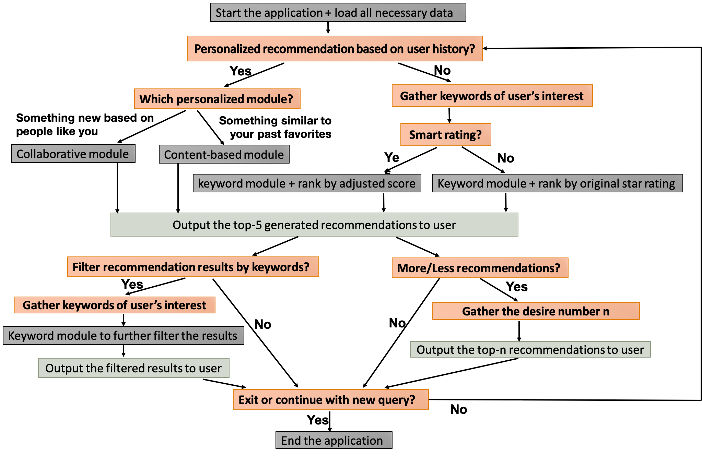

# Yelp Business Insights & Hybrid Restaurant Recommendation Engine

## Abstract
This capstone project is part of the data science career track program at Springboard. EDA and interactive visualizations are performed on Yelp open dataset (Yelp dataset challenge) to understand restaurant, user and review patterns on Yelp platform. A hybrid recommendation engine is developed powered by the Yelp dataset, offering a combination of non-personalized keyword-search recommendation, personalized collaborative recommendation and personalzied restaurant content-based recommendation at users' choice.

## Executive Summary

### * Yelp Business Insights
The Yelp open dataset of 5,996,996 reviews, 1,518,169 users, 188,593 businesses, 1,185,348 tips, and over 1.4 million business attributes for each of the 188,593 businesses is obtained, cleaned, analyzed in this project. **Interactive visualizations are also created using Bokeh server.**  

**The key business findings are:**
* Only a subset of Yelp restaurants from a few selected states are available in this dataset. Among them, only Arizona, Nevada, Ohio, North Carolina and Pennsylvania have a rich catalog of over 5000 restaurants. 
* The most common restaurants are the popular chain or franchised restaurants, fast food or coffee shops, Starbucks, McDonald's and Subway being the top three among all.
* The average restaurant rating is around 3.5 and is similar among various locations, with 3.5 and 4.0 being the most common ratings. Half of the restaunrants have less than 30 reviews, but restaurants from Nevada (Las Vegas) have significant more reviews than others. The correlation between rating and review suggests that restaurants with more reviews tend to have higher ratings on average.
* Most restaurants are in the low (40.9%) and mid (41.6%) price ranges. More expensive restaurants tend to receive more reviews on average, but the average rating remains similar.
* The most popular cuisine of restaurants overall is American style (traditional and new), followed by Mexican, Italian and Chinese, whereas the most popular restaurant setting is the formal restaurant style, followed by the nightlife/bar style and fast food. The above preference of cuisine varies quite a bit by location.
* A steady increase of new users has continued since Yelp's debut in 2004 till 2015, followed by a significant decline thereafter. The average rating given by Yelp users is 3.72, and 60% of the users have less than 10 reviews in total, suggesting that most users post reviews on Yelp only occationally.
* The daily number of reviews posted on Yelp shows a steady upward trend with seasonal fluctuations, whereas the daily number of tips only increased in the first four years and slowly dived down thereafter, suggesting tip is not as popular as review. Two thirds of restaurant reviews on Yelp are associated with a positive star rating of 4+. 
* Half of the restaurants have less than 20 checkins, indicating that checkin is not a widely used feature on Yelp when compared with review.

### * Hybrid Restaurant Recommendation Engine Powered by Yelp Datasets
A non-personalized keyword-search recommender module, a personalized collaborative recommender module and a personalized restaurant content-based recommender module are implemented and a user-friendly interface is created to integrate the three submodules, gather user interests and navigate users through the hybrid recommendation engine via user interactive questions.

**Capabilities of the hybrid recommendation engine include:** 
* **A non-personalized keyword-search recommender module** supports a combination of restaurant location-based (zip code, city, state) keyword filtering and restaurant feature-based (cuisine, style, price) keyword filtering of restaurant catalog, and returns the customized recommendations by ranking the filtered catalog based on ranking criteria of user's choice.
* **A personalzied collaborative recommender module** supports personalized restaurant recommendation given the unique user_id. The personalization is computed based on the user's and all other users' rating history of all Yelp businesses via an optimized matrix factorization model, then user-unrated restaurants from the catalog are ranked by ratings predicted by the model and returned as personalized recommendations.  
* **A personalized restaurant content-based recommender module:** supports personalized restaurant recommendation given the unique user_id. The personalization is computed based on the similarity between the user's preference indicated by historical ratings and all restaurants' features extracted from a rich set of Yelp restaurant review texts, then user-unrated restaurants from the catalog are ranked by similarity score and returned as personalized recommendations. 
* **Further filter a recommendation list by keyword:** supports further filtering the recommendation results by a combination of restaurant location-based keywords and restaurant feature-based keywords by feeding the recommendation results as the restaurant catalog to the 'non-personalized keyword-search recommender module'.
* **An adjusted rating score is also introduced as an improved metric over the original restaurant average star ratings** supports ranking the restaurants by the adjusted rating as an alternative ranking criteria. The adjusted rating score uses the mechanism of the damped mean to regulate restaurants with different number of ratings, with the merit of incorporating both average restaurant rating (goodness) and number of ratings (popularity).
* **A user-friendly interface** supports flexible navigation among the three available recommender modules at user's choice and options to further filter the recommendation results by keywords and/or display the desired number of recommendations. 

**Performance of the hybrid recommendation engine:** 
* **Non-personalized keyword-search module** Test results validate that the recommendation results only contain restaurants matching user's combination of keywords and ranked by the appropriate scores of interest. 
* **Personalized collaborative module** Both the accuracy of rating prediction and the quality of recommendation ranking are computed on unseen testset. RMSE(Root Mean Squared Error) of rating prediction is 1.2777 on testset with new users/restaurants and 1.2443 on testset without new user/restaurant. NDCG (Normalized Discounted Cumulative Gain) of recommendation ranking on testset without new user/restaurant is 0.905 and 0.908 for NDCG@10 and NDCG@5, respectively.
* **Personalized content-based module** The quality of recommendation ranking are computed on unseen testset. NDCG of recommendation ranking on test without new user/restaurant is 0.857 and 0.863 for NDCG@10 and NDCG@5, respectively. 

## Further Readings
Link to the full report: https://github.com/jingzhaomirror/capstone2_hybrid_yelp_recommender/blob/master/final_report.ipynb  
Link to the ppt slide deck: https://github.com/jingzhaomirror/capstone2_hybrid_yelp_recommender/blob/master/slide_deck.pdf
 
